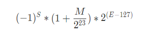

# 左耳听风

### 开篇词 | 洞悉技术的本质，享受科技的乐趣

### 01 | 程序员如何用技术变现（上）

要去经历大多数人经历不到的，要把学习时间花在那些比较难的地方。

要写文章就要写没有人写过的，或是别人写过，但我能写得更好的。

更重要的是，技术和知识完全是可以变现的。

并不是社会不尊重程序员，只要你能帮上大忙，就一定会赢得别人的尊重。

### 02 | 程序员如何用技术变现（下）

第一，千里之行，积于跬步。任何一件成功的大事，都是通过一个一个的小成功达到的。

你得让自己身边的人有求于你，或是向别人推荐你。这就需要你能够掌握大多数人不能掌握的技能或技术，需要你更多地学习，并要有更多的别人没有的经验和经历。

第二，关注有价值的东西。价值其实是受供需关系影响的，供大于求，就没什么价值，供不应求，就有价值。

真正缺的其实是有能力能够解决技术难题的人，能够提高团队人效的人。

在学习技术的过程一定要多问自己两个问题：“一，这个技术解决什么问题？为什么别的同类技术做不到？二，为什么是这样解决的？有没有更好的方式？”

第三，找到能体现价值的地方。在一家高速发展的公司中，技术人员的价值可以达到最大化。

第四，动手能力很重要。在解决任何一个具体问题的时候，有没有动手能力就成为了关键。

第五，关注技术付费点。一个是能帮别人“挣钱”的地方；另一个是能帮别人“省钱”的地方。

第六，提升自己的能力和经历。付费的前提是信任，只有你提升自己的能力和经历后，别人才会对你有一定的信任。

第七，找到有价值的信息源。

第八，输出观点和价值观。

第九，朋友圈很重要。

### 03 | Equifax 信息泄露始末

### 04 | 从 Equifax 信息泄露看数据安全

***数据泄露攻击***

**表面的攻击：**

利用程序框架或库的已知漏洞。

暴力破解密码。利用密码字典库或是已经泄露的密码来“撞库”。

代码注入。通过程序员代码的安全性问题，如 SQL 注入、XSS 攻击、CSRF 攻击等取得用户的权限。

利用程序日志不小心泄露的信息。

社会工程学。

**数据管理上的问题：**

只有一层安全。

弱密码。密码系统应该不能让用户设置如此简单的密码，而且还要定期更换。最好的方式是通过数据证书、VPN、双因子验证的方式来登录。

向公网暴露了内部系统。

未对系统及时打安全补丁。

安全日志被暴露。

保存了不必要保存的用户数据。

密码没有被合理地散列。一则需要用目前公认安全的算法（比如 SHA-2 256），二则要加一个安全随机数作为盐（salt）。

***专家建议***

理解你的软件产品中使用了哪些支持性框架和库，它们的版本号分别是多少。时刻跟踪影响这些产品和版本的最新安全性声明。

建立一个流程，来快速地部署带有安全补丁的软件产品。

所有复杂的软件都有漏洞。

建立多个安全层。

针对公网资源，建立对异常访问模式的监控机制。

***技术上的安全做法***

安全防范最好是做到连自己内部员工都能防。

首先，我们需要把我们的关键数据定义出来，然后把这些关键数据隔离出来，隔离到一个安全级别非常高的地方。所谓安全级别非常高的地方，即这个地方需要有如安全审计、安全监控、安全访问。

一般来说，在这个区域内，这些敏感数据只入不出。通过提供服务接口来让别的系统只能在这个区域内操作这些数据，而不是把数据传出去，让别的系统在外部来操作这些数据。

另外，如果业务必需返回用户的数据，对于像信用卡这样的关键数据是死也不能返回全部数据的，只能返回一个被“马赛克”了的数据（隐藏掉部分信息）。就算需要返回一些数据（如用户的地址），那么也需要在传输层上加密返回。

而用户加密的算法一定要采用非对称加密的方式，而且还要加上密钥的自动化更换。

这个区域中的数据也是需要加密存放的，而加密使用的密钥则需要放在另外一个区域中。也就是说，被加密的数据和用于加密的密钥是由不同的人来管理的，有密钥的人没有数据，有数据的人没有密钥，这两拨人可以有访问自己系统的权限，但是没有访问对方系统的权限。

密钥一定要做到随机生成，最好是对于不同用户的数据有不同的密钥，并且时不时地就能自动化更新一下，这样就可以做到内部防范。

用户需要更新密钥时，需要对用户做身份鉴别，可以通过双因子认证，也可以通过更为严格的物理身份验证。

最后，每当这些关键信息传到外部系统，需要做通知，最好是通知用户和自己的管理员。并且限制外部系统的数据访问量，超过访问量后，需要报警或是拒绝访问。

### 05 | 何为技术领导力？

***技术重要吗？***

“野蛮开采” | “精耕细作”

***什么是技术领导力？***

尊重技术，追求核心基础技术。

追逐自动化的高效率的工具和技术，同时避免无效率的组织架构和管理。

解放生产力，追逐人效的提高。

开发抽象和高质量的可以重用的技术组件。

坚持高于社会主流的技术标准和要求。

***如何拥有技术领导力？***

**“技术领导力”特质**

能够发现问题。能够发现现有方案的问题。

能够提供解决问题的思路和方案，并能比较这些方案的优缺点。

能够做出正确的技术决定。用什么技术、什么解决方案、怎样实现来完成一个项目。

能够用更优雅，更简单，更容易的方式来解决问题。

能够提高代码或软件的扩展性、重用性和可维护性。

能够用正确的方式管理团队。所谓正确的方式，一方面是，让正确的人做正确的事，并发挥每个人的潜力；另一方面是，可以提高团队的生产力和人效，找到最有价值的需求，用最少的成本实现之。并且，可以不断地提高自身和团队的标准。

创新能力。能够使用新的方法、新的方式解决问题，追逐新的工具和技术。

一句话，总是在提供解决问题的思路和方案的人才是有技术领导力的人。

**如何拥有“技术领导力”**

扎实的基础技术；非同一般的学习能力；坚持做正确的事；不断提高对自己的要求标准

### 06 | 如何才能拥有技术领导力？

***第一，你要吃透基础技术***

基础技术是各种上层技术共同的基础。吃透基础技术是为了更好地理解程序的运行原理，并基于这些基础技术进化出更优化的产品。

**编程部分**

C 语言 / 编程范式 / 算法和数据结构

**系统部分**

计算机系统原理 / 操作系统原理和基础 / 网络基础 / 数据库原理 / 分布式技术架构

《深入理解计算机系统》（Randal E. Bryant）

要学习操作系统知识，一是要仔细观察和探索当前使用的操作系统，二是要阅读操作系统原理相关的图书，三是要阅读 API 文档（如 man pages 和 MSDN Library），并编写调用操作系统功能的程序。这里推荐三本书《UNIX 环境高级编程》、《UNIX 网络编程》和《Windows 核心编程》。

《TCP / IP 详解》

要学习数据库，你可以阅读各类数据库图书，并多做数据库操作以及数据库编程，多观察分析数据库在运行时的性能。

学习分布式技术架构的有效途径是参与到分布式项目的开发中去，并阅读相关论文。

***第二，提高学习能力***

所谓学习能力，就是能够很快地学习新技术，又能在关键技术上深入的能力。

**学习的信息源**

如果今天使用中文搜索就可以满足你的知识需求，那么你就远远落后于这个时代了。如果用英文搜索才能找到你想要的知识，那么你才能算跟得上这个时代。而如果说有的问题你连用英文搜索都找不到，只能到社区里去找作者或者其他人交流，那么可以说你已真正和时代同频了。

**与高手交流**

与高手交流对程序员的学习和成长很有益处，不仅有助于了解热门的技术方向及关键的技术点，更可以通过观察和学习高手的技术思维及解决问题的方式，提高自己的技术前瞻性和技术决策力。

**举一反三的思考**

**不怕困难的态度**

**开放的心态**

带有开放的心态，不拘泥于一个平台、一种语言，往往能带来更多思考，也能得到更好的结果。而且，能在不同的方法和方案间做比较，比较它们的优缺点，那么你会知道在什么样的场景下用什么样的方案，你就会比一般人能够有更全面和更完整的思路。

***第三，坚持做正确的事***

**提高效率的事**

你要学习和掌握良好的时间管理方式，管理好自己的时间，能显著提高自己的效率。

**自动化的事**

**掌握前沿技术的事**

掌握前沿的技术，有利于拓展自己的眼界，也有利于找到更好的工作。

**知识密集型的事**

掌握了领域知识的人的价值依然很高。

**技术驱动的事**

***第四，高标准要求自己***

高标准要求自己，不断地反思、总结和审视自己，才能够提升自己。

**Google 的自我评分卡** / **敏锐的技术嗅觉** / **强调实践，学以致用** / **Lead by Example**

***第五，软技能***

良好的沟通能力、组织能力、驱动力、团队协作能力等等。

《技术领导之路》、《卓有成效的管理者》

### 07 | 推荐阅读：每个程序员都该知道的知识

***每个程序员都应该要读的书***

[What is the single most influential book every programmer should read?](https://stackoverflow.com/questions/1711/what-is-the-single-most-influential-book-every-programmer-should-read)

《代码大全》/《程序员修练之道》/《计算机程序的构造和解释》/《算法导论》/《设计模式》/《重构》/《人月神话》/《代码整洁之道》/《Effective C++》/《More Effective C++》/《Unix 编程艺术》/《Unix 高级环境编程》

***每个搞计算机专业的学生应有的知识***

[What every computer science major should know](https://matt.might.net/articles/what-cs-majors-should-know/)

首先，对于我们每个人来说，作品集（Portfolio）会比简历（Resume）更有参考意义。所以，在自己的简历中应该放上自己的一些项目经历，或是一些开源软件的贡献，或是你完成的软件的网址等。

其次，计算机专业工作者也要学会与人交流的技巧，包括如何写演示文稿，以及面对质疑时如何与人辩论的能力。

最后，他就各个方面展开计算机专业人士所需要的硬技能：工程类数学、Unix 哲学和实践、系统管理、程序设计语言、离散数学、数据结构与算法、计算机体系结构、操作系统、网络、安全、密码学、软件测试、用户体验、可视化、并行计算、软件工程、形式化方法、图形学、机器人、人工智能、机器学习、数据库等等。

***LinkedIn 高效的代码复查技巧***

[LinkedIn’s Tips for Highly Effective Code Review](https://thenewstack.io/linkedin-code-review/)

LinkedIn 的代码复查有以下几个特点：

强制要求在团队成员之间做代码复查。Code Review 带来的反馈意见让团队成员能够迅速提升自己的技能水平。

通过建立公司范围的 Code Review 工具，这就可以做跨团队的 Code Review。

Code Review 的经验作为员工晋升的参考因素之一。

LinkedIn 要求代码签入版本管理系统前，就对其做清晰的说明，以便复查者了解其目的，促进 Review 的进行。

为了提高员工积极性，LinkedIn 的代码复查工具允许提出“这段代码很棒”之类的话语，以便让好代码的作者得到鼓励。

为 Code Review 的结果写出有目的性的注释。比如“消除重复代码”，“增加了测试覆盖率”等等。长此以往也让团队的价值观得以明确。

Code Review 中，不但要 Review 提交者的代码，还要 Review 提交者做过的测试。

对 Code Review 有明确的期望，不过分关注细枝末节，也不要炫技，而是对要 Review 的代码有一个明确的目标。

***编程语言和代码质量的研究报告***

[A Large-Scale Study of Programming Languages and Code Quality in Github](https://cacm.acm.org/magazines/2017/10/221326-a-large-scale-study-of-programming-languages-and-code-quality-in-github/fulltext)

从查看 bug fix 的 commits 的次数情况来看，C、C++、Objective-C、PHP 和 Python 中有很多很多的 commits 都是和 bug fix 相关的，而 Clojure、Haskell、Ruby、Scala 在 bug fix 的 commits 的数上明显要少很多。

函数式编程语言的 bug 明显比大多数其它语言要好很多。有隐式类型转换的语言明显产生的 bug 数要比强类型的语言要少很多。函数式的静态类型的语言要比函数式的动态类型语言的程序出 bug 的可能性要小很多。

bug 数和软件的领域没有相关性。

bug 的类型和语言是强相关性的。

### 08 | Go 语言，Docker 和新技术

***Go 语言有如下几点体会***

第一，语言简单，上手快。

第二，并行和异步编程几乎无痛点。

第三，Go 语言的 lib 库“麻雀虽小，五脏俱全”。

第四，C 语言的理念和 Python 的姿态。C 语言的理念是信任程序员，保持语言的小巧，不屏蔽底层且对底层友好，关注语言的执行效率和性能。而 Python 的姿态是用尽量少的代码完成尽量多的事。

***一个技术能不能发展起来的关键***

有没有一个比较好的社区 / 有没有一个工业化的标准 / 有没有一个或多个杀手级应用 / 学习难度是否低，上手是否快 / 有没有一个不错的提高开发效率的开发框架 / 是否有一个或多个巨型的技术公司作为后盾 / 有没有解决软件开发中的痛点

***PaaS 层的技术主要能解决下面这些问题***

软件生产线的问题。持续集成和持续发布，以及 DevOps 中的技术必须通过 PaaS。

分布式服务化的问题。分布式服务化的服务高可用、服务编排、服务调度、服务发现、服务路由，以及分布式服务化的支撑技术完全是 PaaS 的菜。

提高服务的可用性 SLA。提高服务可用性 SLA 所需要的分布式、高可用的技术架构和运维工具，也是 PaaS 层提供的。

软件能力的复用。软件工程中的核心就是软件能力的复用，这一点也完美地体现在 PaaS 平台的技术上。

***为什么要早一点地进入这些新技术***

技术的发展过程非常重要。这个过程中，我收获最大的并不是这些技术本身，而是一个技术的变迁和行业的发展。从中，我看到了非常具体的各种浪潮和思路，这些东西比起 Go 和 Docker 来说更有价值。因为，这不但让我重新思考我已掌握的技术以及如何更好地解决已有的问题，而且还让我看到了未来。

这些关键新技术，可以让你提前抢占技术的先机。这一点对一个需要技术领导力的个人或公司来说都是非常重要的。

### 09 | 答疑解惑：渴望、热情和选择

***加班太严重完全没有时间学习，怎么办？***

可能并不在于加班和工作强度大到没时间，关键看你对学习有多少的渴望程度，对要学的东西有多大的热情。这点是非常重要的，因为学习这事其实挺反人性的。反人性的事基本上都是要付出很多，而且还要坚持很久。所以，如果对学习没有渴望的话，或是不能从学习中找到快乐的话，那么其实是很难坚持的，无论你有没有时间。

***为什么你能够写出这么多东西？***

第一个阶段，是学习的阶段。我会把学习到的东西都以笔记的方式记录下来，方便我以后可以翻出来看看。

第二个阶段，是有利益驱动的阶段。

第三个阶段，是记录自己观点打自己脸的阶段。我能够看到自己成长的过程，并且可以及时修正。

第四个阶段，是与他人交互的阶段。一旦一件事被真正地讨论起来，就会有很多知识命中了我的认知盲区。虽然这会被别人批评或是指责，但是，我能从中收获到更多，因为我会从不同的观点，以及别人的批评中，让自己变得更加完善和成熟。而且，我从写作中还能训练自己的表达能力，这让我能够更好更漂亮地与别人交流和沟通。

***怎样选择自己的人生和职业发展？***

一个是在 20-30 岁，这是打基础的阶段。在这个阶段，我们要的是开阔眼界，把基础打扎实，努力学习和成长。

另一个是在 30-40 岁，这是人生发展的阶段。在这个阶段，你需要明确自己奋斗的方向，需要做有挑战的事儿，需要提升自己的技术领导力。

**一些建议**

客观地审视自己。找到自己的长处，不断地在自己的长处上发展自我。在职场上，审视自己的最佳方式，就是隔三差五就出去面试一把，看看自己在市场上能够到什么样的级别。如果你超过了身边的大多数人，你不妨选择得激进一些冒险一些，否则，还是按部就班地来吧。

确定自己想要什么。注意，你不可能什么都要，你需要极端地知道自己要什么。所谓“极端”，就是自己不会受到其它东西或其他人的影响，不会因为这条路上有人退出你会开始怀疑或者迷茫，也不会因为别的路上有人成功了，你就会羡慕。

注重长期的可能性，而不是短期的功利。20-30 岁应该多去经历一些有挑战的事，多去选择能给自己带来更多可能性的事，多去选择能让自己成长的事，尤其是能让自己开阔眼界的事情。

尽量关注自己会得到的东西，而不是自己会失去的东西。

不要和大众的思维方式一样。因为，绝大多数人都是平庸的，所以，如果你的思维方式和大众一样，这意味着你做出来的选择也会和大众一样平庸。

**感慨**

很多事情能做到什么程度，其实在思想的源头就被决定了，因为它会绝大程度地受到思考问题的出发点、思维方式、格局观、价值观等因素影响。

就我们程序员而言，我认为，编码能力很重要，但是技术视野、技术洞察力，以及我们如何用技术解决问题的能力更为重要。

### 10 | 如何成为一个大家愿意追随的 Leader？

***Leader 和 Boss 的不同***

Boss 是驱动员工，Leader 是指导员工。

Boss 制造畏惧，Leader 制造热情。

Boss 面对错误喜欢使用人事惩罚的手段，而 Leader 面对错误喜欢寻找解决问题的技术或管理方法。

Boss 只是知道怎么做，而 Leader 则是展示怎么做。

Boss 是用人，而 Leader 是发展人。

Boss 从团队收割成绩，而 Leader 则是给予团队成绩。

Boss 喜欢命令和控制（Command + Control），而 Leader 喜欢沟通和协作（Communication + Cooperation）。

Boss 喜欢说“给我上”，而 Leader 喜欢说“跟我上”。

***如何成为众人愿意追随的 Leader***

有没有技术领导力（Leadership），是成为一个 Leader 非常关键的因素。

赢得他人的信任。对于信任来说，并不完全是别人相信你能做到某个事，还有别人愿意向你打开心扉，和你说他心里面最柔软的东西。

开放的心态 + 倾向性的价值观。对于新生事物要有开放的心态，对于每个人的观点都有开放的心态，但并不是要认同所有的观点和事情，成为一个油腔滑调的人。我的这些倾向性可以让别人更清楚地知道我是一个什么样的人，而不会对我琢磨不透，一会东一会西只会让人觉得你太油了，反而会产生距离感和厌恶感。

Lead by Example。要做一个有人愿意跟随的技术 Leader，你需要终身写代码，也就是所谓的 ABC – Always Be Coding。这样，你会得到更多的实际经验，能够非常明白一个技术方案的优缺点，实现复杂度，知道什么是 Best Practice，你的方案才会更具执行力和实践性。当有了执行力，你就会获得更多的成就，而这些成就反过来会让更多的人来跟随你。

保持热情和冲劲。所谓的保持热情和冲劲，并不是自欺欺人，也不是文过饰非，因为掩耳盗铃、掩盖问题、强颜欢笑的方式根本不是热情。真正的热情和冲劲是，正视问题，正视不足，正视错误，从中进行反思和总结得到更好的解决方案，不怕困难，迎难而上。

能够抓住重点，看透事物的本质。

描绘令人激动的方向，提供令人向住的环境。

甘当铺路石，为他人创造机会。别人愿意跟随你，愿意和你共事，有一部分原因是你能够给别人带来更多的可能性和机会，别人觉得和你在一起能够成长，能够进步，你能够带着大家到达更远的地方。帮助别人其实就是帮助自己，成就他人其实也是在成就自己。

### 11 | 程序中的错误处理：错误返回码和异常捕捉

***传统的错误检查***

处理错误最直接的方式是通过错误码，这也是传统的方式，在过程式语言中通常都是用这样的方式处理错误的。

其通过函数的返回值标识是否有错，然后通过全局的 errno 变量并配合一个 errstr 数组来告诉你为什么出错。

这种用返回值 + errno 的错误检查方式会有一些问题：

程序员一不小心就会忘记返回值的检查，从而造成代码的 Bug；

函数接口非常不纯洁，正常值和错误值混淆在一起，导致语义有问题。

Windows 的系统调用开始使用 HRESULT 的返回来统一错误的返回值，这样可以明确函数调用时的返回值是成功还是错误。但这样一来，函数的 input 和 output 只能通过函数的参数来完成，于是出现了所谓的入参和出参这样的区别。

一些参数是入参，一些参数是出参，函数接口变得复杂了一些。而且，依然没有解决函数的成功或失败可以被人为忽略的问题。

**多返回值**

Go 语言的很多函数都会返回 result，err 两个值，于是：

参数基本上就是入参，返回接口把结果和错误分离，这样使得函数的接口语义清晰；

Go 语言中的错误参数如果要忽略，需要显式地忽略，用 _ 这样的变量来忽略；

因为返回的 error 是个接口，所以你可以扩展自定义的错误处理。

if err != nil 这样的语句简直是写到吐，只能在 IDE 中定义一个自动写这段代码的快捷键，而且，正常的逻辑代码会被大量的错误处理打得比较凌乱。

***资源清理***

goto fail：你不能在中间的代码中有 return 语句，因为你需要清理资源。在维护这样的代码时需要格外小心，因为一不注意就会导致资源泄漏的问题。

RAII 使用 C++ 类的机制，在构造函数中分配资源，在析构函数中释放资源。

在 Go 语言中，使用 defer 关键字。

***异常捕捉处理***

try - catch - finally

函数接口在 input（参数）和 output（返回值）以及错误处理的语义是比较清楚的。

正常逻辑的代码可以与错误处理和资源清理的代码分开，提高了代码的可读性。

异常不能被忽略（如果要忽略也需要 catch 住，这是显式忽略）。

在面向对象的语言中（如 Java），异常是个对象，所以，可以实现多态式的 catch。

与状态返回码相比，异常捕捉有一个显著的好处是，函数可以嵌套调用，或是链式调用。

try - catch - finally 有个致命的问题，那就是在异步运行的世界里的问题。try 语句块里的函数运行在另外一个线程中，其中抛出的异常无法在调用者的这个线程中被捕捉。

***错误返回码 vs 异常捕捉***

我个人觉得错误可以分为三个大类：

资源的错误。这一类错误属于程序运行环境的问题。对于这类错误，有的我们可以处理，有的我们则无法处理。

程序的错误。这类是我们自己程序的错误，我们要记录下来，写入日志，最好触发监控系统报警。

用户的错误。对于这类问题，我们需要向用户端报错，让用户自己处理修正他们的输入或操作。

逻辑上分类：

对于我们并不期望会发生的事，我们可以使用异常捕捉；对于我们觉得可能会发生的事，使用返回码。

所以，对于上面三种错误的类型来说，程序中的错误，可能用异常捕捉会比较合适；用户的错误，用返回码比较合适；而资源类的错误，要分情况，是用异常捕捉还是用返回值，要看这事是不应该出现的，还是经常出现的。

在大多数情况下，我们会混用这两种报错的方式，有时候，我们还会把异常转成错误码（比如 HTTP 的 RESTful API），也会把错误码转成异常（比如对系统调用的错误）。

使用错误码还是异常捕捉主要还是看我们的错误处理流程以及代码组织怎么写会更清楚。

### 12 | 程序中的错误处理：异步编程以及我的最佳实践

***异步编程世界里的错误处理***

无法使用返回码。因为函数在“被”异步运行中，所谓的返回只是把处理权交给下一条指令，而不是把函数运行完的结果返回。

无法使用抛异常的方式。除了上述的函数立马返回的原因之外，抛出的异常也在另外一个线程中，不同线程中的栈是完全不一样的，所以主线程的 catch 完全看不到另外一个线程中的异常。

最常用的就是 callback 方式。在异步请求的时候，注册几个 OnSuccess()、 OnFailure() 这样的函数，让在另一个线程中运行的异步代码回调过来。

***Java 异步编程的 Promise 模式***

CompletableFuture

***错误处理的最佳实践***

统一分类的错误字典。最好是在一个地方定义相关的错误。

同类错误的定义最好是可以扩展的。

定义错误的严重程度。

错误日志的输出最好使用错误码，而不是错误信息。打印错误日志的时候，应该使用统一的格式。但最好不要用错误信息，而应使用相应的错误码，错误码不一定是数字，也可以是一个能从错误字典里找到的一个唯一的可以让人读懂的关键字。这样，会非常有利于日志分析软件进行自动化监控，而不是要从错误信息中做语义分析。

忽略错误最好有日志。

对于同一个地方不停的报错，最好不要都打到日志里。最好的实践是，打出一个错误以及出现的次数。

不要用错误处理逻辑来处理业务逻辑。如果一个逻辑控制可以用 if - else 清楚地表达，那就不建议使用异常方式处理。异常捕捉是用来处理不期望发生的事情，而错误码则用来处理可能会发生的事。

对于同类的错误处理，用一样的模式。

尽可能在错误发生的地方处理错误。因为这样会让调用者变得更简单。

向上尽可能地返回原始的错误。如果一定要把错误返回到更高层去处理，那么，应该返回原始的错误，而不是重新发明一个错误。

处理错误时，总是要清理已分配的资源。

不推荐在循环体里处理错误。

不要把大量的代码都放在一个 try 语句块内。

为你的错误定义提供清楚的文档以及每种错误的代码示例。

对于异步的方式，推荐使用 Promise 模式处理错误。

对于分布式的系统，推荐使用 APM 相关的软件。

### 13 | 魔数 0x5f3759df

***计算机的浮点数表示***

在 C 语言中，计算机的浮点数表示用的是 IEEE 754 标准，这个标准的表现形式其实就是把一个 32 bits 分成三段。

第一段占 1 bit，表示符号位。代称为 S（sign）。

第二段占 8 bits，表示指数。代称为 E（Exponent）。

第三段占 23 bits，表示尾数。代称为 M（Mantissa）。



什么叫指数？也就是说，对于任何数 x，其都可以找到一个 n，使得 2^n <= x <= 2^(n+1)。而浮点数的这个指数为了要表示 0.00x 的小数，所以需要有负数，这 8 个 bits 本来可以表示 0 - 255，为了表示负的，取值要放在 [-127, 128] 这个区间中。

尾数位，也就是小数位，但是这里叫偏移量可能好一些。这里的取值是从 [0, 2^23] 中，你可以认为，我们把一条线分成 2^23 个线段，也就是 8388608 个线段。也就是说，把 2^n 到 2^(n+1) 分成了 8388608 个线段，而存储的 M 值，就是从 2^n 到 x 要经过多少个段。

### 14 | 推荐阅读：机器学习 101

***监督式学习***

所谓监督式学习，也就是说，我们需要提供一组学习样本，包括相关的特征数据以及相应的标签。程序可以通过这组样本来学习相关的规律或是模式，然后通过得到的规律或模式来判断没有被打过标签的数据是什么样的数据。

***非监督式学习***

数据是没有被标注过的，所以相关的机器学习算法需要找到这些数据中的共性。

非监督式的学习，可以为我们找到人类很难发现的数据里的规律或模型。所以，也有人将这种学习称为“特征点学习”。其可以让我们自动地为数据进行分类，并找到分类的模型。

监督式学习是在被告诉过正确的答案之后的学习，而非监督式学习是在没有被告诉正确答案时的学习，所以说，非监督式的学习是在大量的非常混乱的数据中找寻一些潜在的关系，这个成本也比较高。

在监督式的学习的算法下，我们可以用一组“狗”的照片来确定某个照片中的物体是不是狗。而在非监督式的学习算法下，我们可以通过一个照片来找到与其相似事物的照片。

***如何找到数据的规律和关联***

机器学习基本就是在已知的样本数据中寻找数据的规律，在未知的数据中找数据的关系。

**基本方法论**

要找到数据中的规律，你需要找到数据中的特征点。

把特征点抽象成数学中的向量，也就是所谓的坐标轴。

抽象成数学向量后，就可以通过某种数学公式来表达这类数据，这就是数据建模。

***相关算法***

[The 10 Algorithms Machine Learning Engineers Need to Know](https://www.kdnuggets.com/2016/08/10-algorithms-machine-learning-engineers.html)

***相关推荐***

### 15 | 时间管理：同扭曲时间的事儿抗争

从管理层到执行层都会想方设法帮助程序员专注地做好开发工作。包括尽可能的不开会，不开长会，需求和设计都是要论证很久才会决定做不做，项目管理会帮你把你处理额外工作的时间也算进去，还会把你在学习上花的时间也计算进去。

***主动管理***

无论什么事情，如果你发现你持续处于被动的状态下，那么你一定要停下来想一想如何把被动变为主动。

如果你发现你的时间老是被别人打断，那么你就要告诉大家，我什么时间段在做什么事，请大家不要打扰我。

可以仿照一下以前在 Outlook 里设置工作日程的方式，把你的工作安排预先设置到一个可以共享的日历上，然后分享给大家，让大家了解你的日程。

你甚至可以要求你的同事，重要的事不要发微信，而是要发邮件，因为微信会有很大概率看不到。

信息管理真的非常重要，因为将信息做好分类，才方便检索，方便你通过自己的优先级来处理信息。

你要主动管理的不是你的时间，而是管理你的同事，管理你的信息。

***学会说“不”***

你要学会对某些事说“不”，甚至是要学习对老板说不。这其实是一种“向上管理”的能力。

**给出另一个你可以做到的方案，而不是把对方的方案直接回绝掉。**

**我不说我不能完全满足你，但我说我可以部分满足你。**

**我不能说不，但是我要有条件地说是。而且，我要把你给我的压力再反过来还给你，看似我给了需求方选择，实际上，我掌握了主动。**

a. 我可以加班加点完成，但是我不保证好的质量，有 bug 你得认，而且事后你要给我 1 个月的时间还债。

b. 我可以加班加点，还能保证质量，但我没办法完成这么多需求，能不能减少一些？

c. 我可以保质保量地完成所有的需求，但是，能不能多给我 2 周时间？

**你要学会在“积极主动的态度下对于不合理的事讨价还价”。只有学会了说“不”，你才能够控制好你的时间。**

***加班和开会***

因为加班干出来了质量不好的软件，于是线上故障很多，要花时间处理，而后面的需求也过来了，发现复杂代码的扩展性很差，越干越慢，越干越烂，越干故障越多。

如果怎么做都要受伤害，那么两害相权取其轻。你要学会比较是项目延期的伤害大，还是线上故障的伤害大，是先苦后甜好，还是积压问题好。

开会，不是讨论问题，而是讨论方案，开会不是要有议题，而是要有议案。

### 16 | 时间管理：如何利用好自己的时间？

***投资自己的时间***

**花时间学习基础知识，花时间读文档。**系统地学习一门技术是非常关键的，所以这个时间是值得投资的。

**花时间在解放自己生产力的事上。**在自动化、可配置、可重用、可扩展上要多花时间。

**花时间在让自己成长的事上。**成长不应该只看在一个公司内，而是要看在行业内，在行业内的成长才是真正的成长。所以，把时间花在能让自己成长，能让自己有更强的竞争力，能让自己有更大的视野，能让自己有更多可能性的事情上。

**花时间在建立高效的环境上。**

***规划自己的时间***

**定义好优先级。**

**最短作业优先。**长作业通常很容易出现“意外情况”让你花更多的时间，但此时你发现还有很多别的事没有做，这会让你产生焦虑感，产生更多的压力，进而导致更慢的生产效率。

**想清楚再做。**如果你没有想清楚，你总是要对已完成的工作进行返工。所以，对于一些没想清楚的事，或是自己不太有信心的事，还是先看看有没有已有的成熟解决方案，或是找更牛的人来给你把把关，帮你出出主意，看看有没有更好、更简单的方式。

**关注长期利益规划。**要多关注长远可以节省多少时间，而不是当前会花费多少时间。宁可在短期延期，也不要透支未来。你要学会规划自己的行动计划，不是短期的，而是一个中长期的。我个人建议是按季度来规划，这个季度做什么，达到什么目标，一年往前走四步，而不是只考虑眼下。

***用好自己的时间***

**将军赶路不追小兔。**能专注地把时间投入到一个有价值的事上是非常重要的。

比如，不要让别人来影响自己的心情，心情被影响了，你一下就会什么都不想干了。再比如，知道哪些是自己可以控制的事，哪些是自己控制不了的事，在自己能控制的地方花时间。

再比如，知道哪些是更有效的路径，是花时间改变别人，还是花时间去寻找志同道合的人。不与不如自己的人争论，也不要尝试花时间去叫醒那些装睡的人。多花时间在有产出的事上，少花时间在说服别人的事上。

**形成习惯。**“做”比“做好”更重要。

*形成正反馈。*学习是逆人性的事儿，但如果在学习过程中不断地有正反馈，就更利于我们坚持下去。要让自己有正反馈，那就需要把时间花在有价值的地方，比如，解决自己和他人的痛点，这样你会收获别人的赞扬和鼓励。

*反思和举一反三。*可以尝试每周末花上点时间思考一下，本周做了哪些事儿？时间安排是否合理？还有哪些可以优化提高的地方？然后思考一下，下周的主要任务是什么？并根据优先级规划一下完成这些任务的顺序。

### 17 | 故障处理最佳实践：应对故障

***故障发生时***

在故障发生时，最重要的是快速恢复故障。而快速恢复故障的前提是快速定位故障源。

故障源团队通常会有以下几种手段来恢复系统：

**重启和限流。**重启和限流主要解决的是可用性的问题，不是功能性的问题。

**回滚操作。**回滚操作一般来说是解决新代码的 bug，把代码回滚到之前的版本。

**降级操作。**需要挂一个停止服务的故障公告，主要是不要把事态扩大。

**紧急更新。**紧急更新是常用的手段，这个需要强大的自动化系统，尤其是自动化测试和自动化发布系统。

出现故障时，最重要的不是 debug 故障，而是尽可能地减少故障的影响范围，并尽可能快地修复问题。

***故障前的准备工作***

**以用户功能为索引的服务和资源的全视图。**

首先，我们需要一个系统来记录前端用户操作界面和后端服务，以及服务使用到的硬件资源之间的关联关系。然后，把后端的服务、服务的调用关系，以及服务使用到的资源都关联起来做成一个视图。

这个视图最好是由相应的自动化监控系统生成。有了这个资源图后，我们就可以很容易地找到处理故障的路径了。

**为地图中的各个服务制定关键指标，以及一套运维流程和工具，包括应急方案。**

以用户功能为索引，为每个用户功能的服务都制定一个服务故障的检测、处理和恢复手册，以及相关的检测、查错或恢复的运维工具。

这就好像一个导航仪，能够告诉你怎么做。而没有导航仪，就没有章法，会导致混乱。

**设定故障的等级。**

制定故障等级，主要是为了确定该故障要牵扯进多大规模的人员来处理。故障级别越高，牵扯进来的人就越多，参与进来的管理层级别也就越高。

这就好像是我们社会中常用的“红色警报”、“橙色警报”、“黄色警报”之类的，会触发不同的处理流程。

**故障演练。**

要提升故障处理水平，最好的方式就是实践。见得多了，处理得多了，才能驾轻就熟。故障演练是一个非常好的实践。

**灰度发布系统。**

要减少线上故障的影响范围，通过灰度发布系统来发布是一个很不错的方式。

### 18 | 故障处理最佳实践：故障改进

***故障复盘过程***

故障处理的整个过程。

故障原因分析。

Ask 5 Whys。

故障后续整改计划。

**老实说，我对惩罚故障责任人的方式非常不认同。**

首先，惩罚故障责任人对于解决故障完全没有任何帮助。

其次，做得越多，错得越多。如果不想出错，最好什么也不要做。所以，惩罚故障责任人只会让大家都很保守，也会让大家都学会保守，而且开始推诿，营造一种恐怖的气氛。

***故障整改方法***

第一，优化故障获知和故障定位的时间。

从故障发生到我们知道的时间是否可以优化得更短？

定位故障的时间是否可以更短？

有哪些地方可以做到自动化？

第二，优化故障的处理方式。

故障处理时的判断和章法是否科学，是否正确？

故障处理时的信息是否全透明？

故障处理时人员是否安排得当？

第三，优化开发过程中的问题。

Code Review 和测试中的问题和优化点。

软件架构和设计是否可以更好？

对于技术欠债或是相关的隐患问题是否被记录下来，是否有风险计划？

第四，优化团队能力。

如何提高团队的技术能力？

如何让团队有严谨的工程意识？

***找到问题的本质***

一个技术问题，后面隐藏的是工程能力问题，工程能力问题后面隐藏的是管理问题，管理问题后面隐藏的是一个公司文化的问题，公司文化的问题则隐藏着创始人的问题……

举一反三解决当下的故障。

简化复杂、不合理的技术架构、流程和组织。如果你要从根本上改善一个事，那么首先得把它简化了。

全面改善和优化整个系统，包括组织。

### 19 | 答疑解惑：我们应该能够识别的表象和本质

***关于兴趣和投入***

兴趣是学习的助燃剂。对一件事有兴趣是是否愿意对这件事投入更多时间或者资源的前提条件。

一方面，兴趣是需要保持的。

另一方面，兴趣其实也是可以培养出来的。

兴趣只是开始，而能让人不断投入时间和精力的则是正反馈，是成就感。

你对一件事的兴趣只是一种表象，而内在更多的是你做这件事的成就感是否可以持续。你需要找到让自己能够更有成就感的事情，兴趣总是可以培养的。

***关于学习和工作***

工作能为我们带来相应的场景和实际的问题，而不是空泛的学习。带着问题去学习，带着场景去解决问题，的确是一种高效的学习方式。

在工作当中，有同事和高手帮助。和他们的交互和讨论，可以让你更快地学习和成长。

本质上来说，并不是只有找到了相应的工作我们才可以学好一项技术，而是，我们在通过解决实际问题，在和他人讨论，获得高手帮助的环境中，才能更快更有效率地学习和成长。

两点建议：

找工作不只是找用这个技术的工作，更是要找场景，找实际问题，找团队。

在一些开源社区内，有助于学习的场景会更多，要解决的实际问题也更多，同时你能接触到的牛人也更多。

***关于技术和价值***

我个人觉得一项有价值的技术，并不在于这项技术是否有技术含量，而是在于：

能否低成本高效率地解决实际问题；

是不是众多产品的基础技术；

是不是可以支持规模化的技术。

***关于趋势和未来***

这个世界的技术趋势和未来其实是被人控制的。

技术的未来要去哪，主要是看这个世界的投入会到哪。

### 20 | Git 协同工作流，你该怎么选？

***中心式协同工作流***

git pull origin master / git commit / git push origin master

git pull --rebase / git rebase --continue

***功能分支协同工作流***

同时开发一个功能的开发人员可以分享各自的代码，但是不会把代码分享给开发其他功能的开发人员，直到整个功能开发完毕后，才会分享给其他的开发人员（也就是进入主干分支）。

git checkout -b new-feature / add & commit / git push -u origin new-feature

git pull --rebase / Pull Request & Code Review

这种开发也是以服务器为中心的开发，还不是 Git 分布式开发，它只不过是用分支来完成代码改动的隔离。

Git 的最佳实践希望大家在开发过程中，快速提交，快速合并，快速完成。这样可以少很多冲突，所以叫功能分支。

***GitFlow 协同工作流***

整个代码库中一共有五种分支：

Master 分支。主干分支，用作发布环境，上面的每一次提交都是可以发布的。

Feature 分支。功能分支，用于开发功能，其对应的是开发环境。

Developer 分支。开发分支，一旦功能开发完成，就向 Developer 分支合并，合并完成后，删除功能分支。这个分支对应的是集成测试环境。

Release 分支。当 Developer 分支测试达到可以发布状态时，开出一个 Release 分支来，然后做发布前的准备工作。这个分支对应的是预发环境。之所以需要这个 Release 分支，是我们的开发可以继续向前，不会因为要发布而被 block 住而不能提交。一旦 Release 分支上的代码达到可以上线的状态，那么需要把 Release 分支向 Master 分支和 Developer 分支同时合并，以保证代码的一致性。然后再把 Release 分支删除掉。

Hotfix 分支。用于处理生产线上代码的 Bug-fix，每个线上代码的 Bug-fix 都需要开一个 Hotfix 分支，完成后，向 Developer 分支和 Master 分支上合并。合并完成后，删除 Hotfix 分支。

***GitHub / GitLab 协同工作流***

**GitFlow 的问题**

其中有个问题是，因为分支太多，所以会出现 git log 混乱的局面。

只有 feature 合并到 developer 分支时，使用 --no-ff 参数，其他的合并都不使用 --no-ff 参数做合并。

还有一个问题是，在开发得足够快的时候，你会觉得同时维护 Master 和 Developer 两个分支是一件很无聊的事，因为这两个分支在大多数情况下都是一样的。而你的整个开发过程也会因为这么复杂的管理变得非常复杂。

**GitHub Flow**

每个开发人员都把“官方库”的代码 fork 到自己的代码仓库中。

开发人员的代码库中需要配两个远程仓库，一个是自己的库，一个是官方库（用户的库用于提交代码改动，官方库用于同步代码）。

向“官方库”发起 Pull Request，并做 Code Review。

**GitLab Flow**

引入环境分支，其包含了预发布（Pre-Production）和生产（Production）分支。

有些时候，我们还会有不同版本的发布，所以，还需要有各种 release 分支。

***协同工作流的本质***

代码的协同工作流属于 SCM（Software Configuration Management）的范畴，要挑选好适合自己的方式，我们需要知道软件工程配置管理的本质。

不同的团队能够尽可能地并行开发。

不同软件版本和代码的一致性。

不同环境和代码的一致性。

代码总是会在稳定和不稳定间交替。我们希望生产线上的代码总是能对应到稳定的代码上来。

软件开发的工作模式：

以微服务或是 SOA 为架构的方式。一个大型软件会被拆分成若干个服务，那么，我们的代码应该也会跟着服务拆解成若干个代码仓库。这样一来，我们的每个代码仓库都会变小，于是我们的协同工作流程就会变简单。这样一来， GitFlow 这种协同工作流程就非常重了，而 GitHub 这种方式或是功能分支这种方式会更适合我们的开发。

以 DevOps 为主的开发流程。DevOps 关注于 CI/CD，需要我们有自动化的集成测试和持续部署的工具。不需要维护多个版本，也不需要关注不同的运行环境，只需要一套代码就可以了。GitHub Flow 或是功能分支这种方式也更适应这种开发。

协同工作流的本质，并不是怎么玩好代码仓库的分支策略，而是玩好我们的软件架构和软件开发流程。

与其花时间在 Git 协同工作流上，还不如把时间花在调整软件架构和自动化软件生产和运维流程上来，这才是真正简化协同工作流程的根本。

### 21 | 分布式系统架构的冰与火

***分布式系统架构的冰与火***

使用分布式系统主要有两方面原因：增大系统容量；加强系统可用。

分布式系统架构的难点在于系统设计，以及管理和运维。

***分布式系统的发展***

面向服务的架构有以下三个阶段：

单体架构，软件模块高度耦合。

比较松耦合的 SOA 架构，这个架构需要一个标准的协议或是中间件来联动其它相关联的服务（如 ESB）。

微服务架构，每一个微服务都能独立完整地运行（所谓的自包含），后端单体的数据库也被微服务这样的架构分散到不同的服务中。

[Microservices](https://martinfowler.com/articles/microservices.html)

微服务的出现使得开发速度变得更快，部署快，隔离性高，系统的扩展度也很好，但是在集成测试、运维和服务管理等方面就比较麻烦了。所以，需要一套比较好的微服务 PaaS 平台。就像 Spring Cloud 一样需要提供各种配置服务、服务发现、智能路由、控制总线……还有像 Kubernetes 提供的各式各样的部署和调度方式。

### 22 | 从亚马逊的实践，谈分布式系统的难点

***亚马逊多年的实践***

**分布式服务的架构需要分布式的团队架构。**在亚马逊，一个服务由一个小团队（Two Pizza Team 不超过 16 个人，两张 Pizza 可以喂饱的团队）负责，从前端到数据，从需求分析到上线运维。按职责分工，而不是按技能分工。

**分布式服务查错不容易。**在故障发生的一开始，大家都在签到并自查自己的系统。如果没问题，也要在线待命（standby），等问题解决。

**没有专职的测试人员，也没有专职的运维人员，开发人员做所有的事情。**吃自己的狗粮（Eat Your Own Dog Food）。自己写的代码自己维护自己养，会让开发人员明白，写代码容易维护代码复杂。这样，开发人员在接需求、做设计、写代码、做工具时都会考虑到软件的长期维护性。

**运维优先，崇尚简化和自动化。**

**内部服务和外部服务一致。**无论是从安全方面，还是接口设计方面，无论是从运维方面，还是故障处理的流程方面，亚马逊的内部系统都和外部系统一样对待。这样做的好处是，内部系统的服务随时都可以开放出来。

***分布式系统中需要注意的问题***

**问题一：异构系统的不标准问题**

分布式系统架构需要有相应的规范。

Swagger 规范

**问题二：系统架构中的服务依赖性问题**

如果非关键业务被关键业务所依赖，会导致非关键业务变成一个关键业务。

服务依赖链中，出现“木桶短板效应”——整个 SLA 由最差的那个服务所决定。

服务治理不但需要我们定义出服务的关键程度，还需要我们定义或是描述出关键业务或服务调用的主要路径。

我们不但要拆分服务，还要为每个服务拆分相应的数据库。

**问题三：故障发生的概率更大**

SLA 要求我们定义出“Key Metrics”，也就是所谓的关键指标。

Design for Failure。在设计时就要考虑如何减轻故障。如果无法避免，也要使用自动化的方式恢复故障，减少故障影响面。

**问题四：多层架构的运维复杂度更大**

通常来说，我们可以把系统分成四层：基础层、平台层、应用层和接入层。

基础层就是我们的机器、网络和存储设备等。平台层就是我们的中间件层，Tomcat、MySQL、Redis、Kafka 之类的软件。应用层就是我们的业务软件，比如，各种功能的服务。接入层就是接入用户请求的网关、负载均衡或是 CDN、DNS 这样的东西。

任何一层的问题都会导致整体的问题；没有统一的视图和管理，导致运维被割裂开来，造成更大的复杂度。

***总结***

分布式服务架构是需要从组织，到软件工程，再到技术上的一个大的改造，需要比较长的时间来磨合和改进，并不断地总结教训和成功经验。

### 23 | 分布式系统的技术栈

一是提高整体架构的吞吐量，服务更多的并发和流量，二是为了提高系统的稳定性，让系统的可用性更高。

***提高架构的性能***

缓存系统 / 负载均衡系统 / 异步调用 / 数据分区和数据镜像

***提高架构的稳定性***

服务拆分 / 服务冗余 / 限流降级 / 高可用架构 / 高可用运维

***分布式系统的关键技术***

服务治理 / 架构软件管理 / DevOps / 自动化运维 / 资源调度管理 / 整体架构监控 / 流量控制

***分布式系统的“纲”***

应用整体监控 / 资源、服务调度 / 状态数据调度 / 流量调度

### 24 | 分布式系统关键技术：全栈监控

***多层体系的监控***

基础层 / 中间层 / 应用层

***什么才是好的监控系统***

**关注于整体应用的 SLA。**主要从为用户服务的 API 来监控整个系统。

**关联指标聚合。**最重要的是把服务（应用层）和相关的中间件（中间层）以及主机（基础层）关联在一起。

**快速故障定位。**快速定位问题需要对整个分布式系统做一个用户请求跟踪的 trace 监控，我们需要监控到所有的请求在分布式系统中的调用链，这个事最好是做成没有侵入性的。

一个好的监控系统主要是为以下两个场景所设计的：

**“体检”**

容量管理 / 性能管理

**“急诊”**

定位问题 / 性能分析

***如何做出一个好的监控系统***

**服务调用链跟踪。**Google Dapper / Zipkin

**服务调用时长分布。**Zipkin

**服务的 TOP N 视图。**一般来说，这个排名会有三种排名的方法：按调用量排名，按请求最耗时排名，按热点排名。

**数据库操作关联。**

**服务资源跟踪。**

### 25 | 分布式系统关键技术：服务调度

***服务关键程度和服务的依赖关系***

关于服务关键程度，主要是要我们梳理和定义服务的重要程度。这不是使用技术可以完成的，它需要细致地管理对业务的理解，才能定义出架构中各个服务的重要程度。

依赖越多，依赖越复杂，我们的系统就越易碎。我们只能是降低服务依赖的深度和广度，从而让管理更为简单和简洁。

微服务是服务依赖最优解的上限，而服务依赖的下限是千万不要有依赖环。

解决服务依赖环的方案一般是，依赖倒置的设计模式。在分布式架构上，你可以使用一个第三方的服务来解决这个事。

***服务状态和生命周期的管理***

我们需要有一个服务注册中心，来知道这么几个事：

整个架构中有多少种服务？这些服务的版本是什么样的？每个服务的实例数有多少个，它们的状态是什么样的?每个服务的状态是什么样的？

服务的生命周期通常会有以下几个状态：

Provision，代表在供应一个新的服务；Ready，表示启动成功了；Run，表示通过了服务健康检查；Update，表示在升级中；Rollback，表示在回滚中；Scale，表示正在伸缩中；Destroy，表示在销毁中；Failed，表示失败状态。

***整个架构的版本管理***

由一堆服务的版本集所形成的整个架构的版本控制。

如果我们要回滚一个服务的版本，就可以把与之有版本依赖的服务也一起回滚掉。

***资源 / 服务调度***

**服务状态的维持和拟合**

Kubernetes 调度控制系统

**服务的弹性伸缩和故障迁移**

故障迁移：宠物模式 / 奶牛模式

底层资源的伸缩；服务的自动化部署；服务的健康检查；服务发现的注册；服务流量的调度。

**服务工作流和编排**

简单来说，这需要一个 API Gateway 或一个简单的消息队列来做相应的编排工作。在 Spring Cloud 中，所有的请求都统一通过 API Gateway (Zuul) 来访问内部的服务。

AWS 上的 Simple Workflow 服务。

### 26 | 分布式系统关键技术：流量与数据调度

一方面，服务治理是内部系统的事，而流量调度可以是内部的，更是外部接入层的事。另一方面，服务治理是数据中心的事，而流量调度要做得好，应该是数据中心之外的事，也就是我们常说的边缘计算，是应该在类似于 CDN 上完成的事。

***流量调度***

**流量调度的主要功能**

依据系统运行的情况，自动地进行流量调度，在无需人工干预的情况下，提升整个系统的稳定性；

让系统应对爆品等突发事件时，在弹性计算扩缩容的较长时间窗口内或底层资源消耗殆尽的情况下，保护系统平稳运行。

服务流控 / 流量控制 / 流量管理

**流量调度的关键技术**

高性能 / 扛流量（Paxos、Raft、Gossip 通讯协议） / 业务逻辑 / 服务化（通过 Admin API 来不停机地管理配置变更）

***状态数据调度***

一般来说，我们会通过“转移问题”的方法来让服务变成“无状态的服务”。也就是说，会把这些有状态的东西存储到第三方服务上，比如 Redis、MySQL、ZooKeeper。

**分布式事务一致性的问题**

数据副本是分布式系统解决数据丢失异常的唯一手段。

在解决数据副本间的一致性问题时，我们有一些技术方案：

Master-Slave、Master-Master、Two/Three Phase Commit、Paxos

[分布式系统的事务处理](https://coolshell.cn/articles/10910.html)

凡是通过业务补偿，或是在业务应用层上做的分布式事务的玩法，基本上都是两阶段提交，或是两阶段提交的变种。

**数据结点的分布式方案**

真正解决数据结点调度的方案应该是底层的数据结点。

只有数据结点自身解决了这个问题，才能做到对上层业务层的透明，业务层可以像操作单机数据库一样来操作分布式数据库，这样才能做到整个分布式服务架构的调度。

NFS、Ceph、TiDB、CockroachDB、ElasticSearch、InfluxDB、MySQL Cluster 和 Redis Cluster

### 27 | 洞悉 PaaS 平台的本质

***一家商业公司的软件工程能力***

**提高服务的 SLA**

高可用的系统 / 自动化的运维

[关于高可用的系统](https://coolshell.cn/articles/17459.html)

**能力和资源重用或复用**

软件模块的重用 / 软件运行环境和资源的重用

需要我们有两个重要的能力：一个是“软件抽象的能力”，另一个是“软件标准化的能力”。你可以认为软件抽象就是找出通用的软件模块或服务，软件标准化就是使用统一的软件通讯协议、统一的开发和运维管理方法……这样能让整体软件开发运维的能力和资源得到最大程度的复用，从而增加效率。

**过程的自动化**

软件生产流水线 / 软件运维自动化

***PaaS 平台的本质***

服务化是 PaaS 的本质。软件模块重用，服务治理，对外提供能力是 PaaS 的本质。

分布式是 PaaS 的根本特性。多租户隔离、高可用、服务编排是 PaaS 的基本特性。

自动化是 PaaS 的灵魂。自动化部署安装运维，自动化伸缩调度是 PaaS 的关键。

***PaaS 平台的总体架构***


PaaS 调度层，主要是 PaaS 的自动化和分布式对于高可用高性能的管理。

PaaS 服务能力层，主要是 PaaS 真正提供给用户的服务和能力。

PaaS 流量调度，主要是与流量调度相关的东西，包括对高并发的管理。

PaaS 运营管理，软件资源库、软件接入、认证和开放平台门户。

PaaS 运维管理，主要是 DevOps 相关的东西。

***PaaS 平台的生产和运维***

### 30 | 编程范式游记——起源

编程语言发展到今天，出现了好多不同的代码编写方式，但不同的方式解决的都是同一个问题，那就是如何写出更为通用、更具可重用性的代码或模块。

**C 语言有哪些特性呢？**

C 语言是一个静态弱类型语言，在使用变量时需要声明变量类型，但是类型间可以有隐式转换；

不同的变量类型可以用结构体（struct）组合在一起，以此来声明新的数据类型；

C 语言可以用 typedef 关键字来定义类型的别名，以此来达到变量类型的抽象；

C 语言是一个有结构化程序设计、具有变量作用域以及递归功能的过程式语言；

C 语言传递参数一般是以值传递，也可以传递指针；

通过指针，C 语言可以容易地对内存进行低级控制，然而这加大了编程复杂度；

编译预处理让 C 语言的编译更具有弹性，比如跨平台。

C 语言的这些特性，可以让程序员在微观层面写出非常精细和精确的编程操作，让程序员可以在底层和系统细节上非常自由、灵活和精准地控制代码。

**C 语言的泛型**

```c
void swap(int* x, int* y)
{
  int tmp = *x;
  *x = *y;
  *y = tmp;
}
```

这个函数最大的问题就是它只能给 int 值用，这个世界上还有很多类型包括 double、float，这就是静态语言最糟糕的一个问题。

C 语言的类型泛型基本上来说就是使用 void* 关键字或是使用宏定义。

```c
void swap(void* x, void* y, size_t size)
{
  char tmp[size];
  memcpy(tmp, y, size);
  memcpy(y, x, size);
  memcpy(x, tmp, size);
}
```

新增的 size 参数（我们没有办法检查传入参数的 size，导致我们只能增加接口复杂度，加入一个 size 参数，然后把这个问题抛给调用者了），使用的 memcpy 内存拷贝以及一个 buffer，这增加了编程的复杂度。

```c
#define swap(x, y, size) { \
  char tmp[size]; \
  memcpy(tmp, y, size); \
  memcpy(y, x, size); \
  memcpy(x, tmp, size); \
}
```

因为宏是做字符串替换，所以会导致代码膨胀，导致编译出的执行文件比较大。

可能会有重复执行的问题。

**小结**

在适配数据类型的过程中，C 语言只能使用 void* 或宏替换的方式，这两种方式导致了类型过于宽松，并带来很多其它问题。

适配数据类型，需要 C 语言在泛型中加入一个类型的 size，这是因为我们识别不了被泛型后的数据类型，而 C 语言没有运行时的类型识别，所以，只能将这个工作抛给调用泛型算法的程序员来做了。

总体来说，C 语言设计目标是提供一种能以简易的方式编译、处理低层内存、产生少量的机器码以及不需要任何运行环境支持便能运行的编程语言。

C 语言把非常底层的控制权交给了程序员，它设计的理念是：相信程序员；不会阻止程序员做任何底层的事；保持语言的最小和最简的特性；保证 C 语言最快的运行速度，哪怕牺牲移值性。

从某种角度上来说，C 语言的伟大之处在于——使用 C 语言的程序员在高级语言的特性之上还能简单地做任何底层上的微观控制。

不过，这只是在针对底层指令控制和过程式的编程方式。而对于更高阶、更为抽象的编程模型来说，C 语言这种基于过程和底层的初衷设计方式就会成为它的短板。

编程范式其实就是程序的指导思想，它也代表了这门语言的设计方向，我们并不能说哪种范式更为超前，只能说各有千秋。

### 63 | 区块链技术的本质

去中心化网络有一个前提假设——“网络中的任何结点都是不能信任的，它们中的任何一个都可能会作恶”。

基于这个前提假设，这个分布式的账本系统就需要有如下的设计：任何人都可以拿到所有的数据。所以，数据要能很容易被验证是合法的没有被修改过的，而且也要是很难被人修改的。

基于这个设计，比特币使用了两个比较大的技术：“区块链技术”和“工作量证明共识机制”。

**区块链**

其中有一个一个的区块，每个区块中包括着一组交易信息，然后，每一个区块都会有一个 ID（或是一个地址），这些区块通过记录前一个区块的 ID 来形成一条链。

每个块的 ID 都是通过其内容生成的，所以，只要是内容有一丁点儿的变化，这个 ID 都会完全不一样。

生成 ID 的内容中还包括上一个块的 ID。于是只要上一个块的内容变了，其 ID 也要跟着变（不然就不合法了），那么后面指向这个块的 ID 也要变。

这种一处改，处处改的方式，并不代表不能篡改，而只是让修改面比较大，让你的改动麻烦一点。

越旧的区块的篡改会造成越大面积的修改，于是越旧的区块就不容易篡改，就越安全。反之，越新的区块就越不安全。

**工作量证明共识机制**

与“数据一致性”相关的问题：

以谁的数据为准？在去中心化的网络下，我们只能认为，大多数人认识的数据是对的。只要我控制了一半以上的结点，我让这“大多数人”伪造同一份账本，那么相当于整个账本都被我修改过来了。在没有服务器的去中心化的网络下，所谓的真理只不过是大多数人同意的东西。

“大多数人”的问题 / 意见分歧问题

所谓的“挖矿”其实就是用大规模的计算来找到一个符合系统要求的区块 ID。要找到符合条件的区块 ID 只能通过暴力穷举的方式，所以要付出大量的系统计算资源和电力。

用这种“极度消耗计算力”的方式来提高成本，从而有效地遏制或解决下面几个问题：

修改几乎变得不可能 / 能掌握 51% 算力的人变得几乎不可能

解决分歧。就算是出现了合法冲突的区块（同时出现了多个合理的区块，即区块链出现分支 / 分叉），也就是多个合法的账本。因为挖矿的成本太高，导致要同时跟进多个账本是不可能的，所以矿工们只能赌跟其中一个。大多数人所选择的那一个分支的链就会越来越多，于是另外一边也就无人问津，从而作废了。

### 64 | 区块链技术细节：哈希算法

**hash 算法**

用来生成唯一标识一个数据块的 ID，这个 ID 几乎不能重复。

用来做数据的特征码。只要数据中一个 bit 的数据出现更改，那么整个 hash 值就完全不一样了。

在计算机世界里，有两个很著名的 hash 算法，一个叫 MD5，一个叫 SHA-2。

**关于 Merkle Root**

比特币的每一笔交易会有三个字段，一个是转出方，一个是转入方，还有一个是金额。那么，我们会对每个交易的这三个字段求 hash，然后把交易的 hash 做两两合并，再求其 hash，直到算出最后一个 hash 值。

**比特币的交易模型**

比特币交易中的两个术语，一个是 input，一个是 output，也就是交易的支出方（input）和收入方（output）。

因为比特币没有“余额”的概念，所以需要通过多个 input 来凑，然后 output 这边还需要给自己找零，给矿工小费。

UTXO 因为没有账户和余额的概念，所以可以并行进行多笔交易。要知道你有多少个比特币，只需要把 UTXO 的交易记录统计一下就可以知道了。

